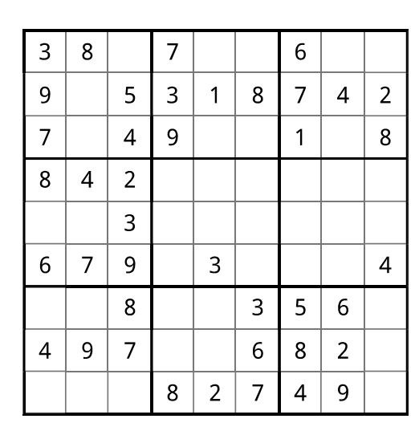
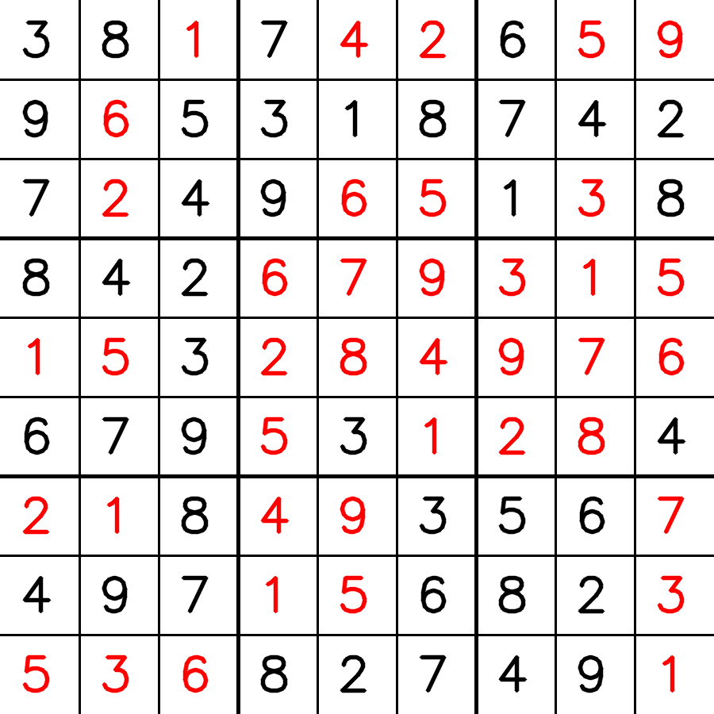

# SudokuSolver

## Overview
An AI-powered Sudoku solver that uses computer vision and deep learning to detect, extract, and solve Sudoku puzzles from images. The system processes images through several steps including edge detection, perspective transformation, digit classification using CNN, and puzzle-solving algorithms.

## Purpose
To create an automated Sudoku solving system that combines computer vision techniques with machine learning for real-world applications. The project demonstrates digital image processing, CNN-based digit recognition, and backtracking algorithm implementation.

### Key Objectives:
- Automatically detect and extract Sudoku grids from images
- Classify digits using a custom-trained CNN model
- Solve Sudoku puzzles using backtracking algorithm
- Generate visual output showing the solving process

## Scope

### Technology Stack:
- **Python**: 3.x
- **Deep Learning**: TensorFlow/Keras
- **Computer Vision**: OpenCV
- **Scientific Computing**: NumPy
- **Visualization**: Matplotlib

### Project Features:
- Image preprocessing with Gaussian blur and Canny edge detection
- Perspective transformation for grid extraction
- CNN model for digit classification (0-9)
- Backtracking algorithm for puzzle solving
- Step-by-step processing visualization
- Model conversion to TensorFlow Lite format

## Implementation

### Project Structure:
```
SudokuSolver/
├── model/
│   ├── train_model.py       # CNN model training
│   ├── test_model.py        # Model testing
│   ├── img/                 # Training dataset (digits 0-9)
│   └── sudoku/              # Saved models
│       ├── model.keras      # Full model
│       └── model.tflite     # Lightweight model
├── sudoku/
│   ├── sudoku_test.py       # Main solver script
│   ├── sudoku_img/          # Input Sudoku images
│   ├── solved_sudoku/       # Solved puzzle outputs
│   └── processing_steps/    # Step-by-step process images
└── README.md
```

### Usage:
```bash
# Train the model (if needed)
cd model
python train_model.py

# Test the model
python test_model.py

# Run Sudoku solver
cd sudoku
python sudoku_test.py
```

### Processing Pipeline:
1. **Image Preprocessing**: Convert to grayscale, apply Gaussian blur
2. **Edge Detection**: Use Canny edge detector
3. **Grid Detection**: Find contours and extract Sudoku grid
4. **Perspective Correction**: Apply perspective transformation
5. **Cell Extraction**: Segment individual cells from grid
6. **Digit Classification**: Use CNN to recognize digits
7. **Puzzle Solving**: Apply backtracking algorithm
8. **Result Visualization**: Generate solved puzzle image

### Model Architecture:
- Input: 100x100 grayscale images
- 3 Convolutional blocks with BatchNormalization and Dropout
- Global Average Pooling
- Dense layers with L2 regularization
- Output: 10 classes (digits 0-9)

## Screenshots



Processing steps include:
- Original → Grayscale → Blurred → Canny Edge → Contours → Perspective → Classified


